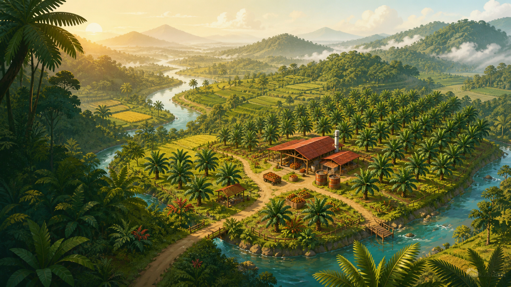

# Sawit Simulator



A cozy, Indonesia-inspired plantation management game for the browser. Start with four plots and a small grant, grow oil palms, harvest *tandan buah segar* (fresh fruit bunches), process them into crude palm oil, follow a changing market, and expand through responsible land agreements.

The game is a static website: there is no build step, backend, account, or paid dependency. Progress is saved in the player's browser.

## Play locally

Open `index.html` directly, or serve the folder with any static file server:

```bash
python3 -m http.server 8000
```

Then visit `http://localhost:8000`.

## Publish with GitHub Pages

1. Create a public GitHub repository.
2. Upload all files and folders from this project to the repository root.
3. In the repository, open **Settings → Pages**.
4. Under **Build and deployment**, choose **Deploy from a branch**.
5. Select the `main` branch and `/ (root)`, then save.

GitHub will provide a public URL after the first deployment finishes.

## What is included

- Plantation grid with planting, growth, compost, and harvesting
- Daily turns, randomized Indonesian weather, and dynamic CPO prices
- FFB-to-CPO processing and a market selling desk
- Four land areas with yield bonuses and reputation requirements
- Three playable side-job mini-games
- Quests, milestones, stewardship, reputation, and progression
- Automatic browser saves plus JSON backup/import
- Exportable CSV business ledger
- Responsive desktop and mobile interface
- Original game illustration and project-local icon

## Project structure

```text
.
├── index.html              # Game screens and accessible structure
├── styles.css              # Responsive interface and visual design
├── app.js                  # Game state, economy, and interactions
├── manifest.webmanifest    # Installable web-app metadata
└── assets/
    ├── favicon.svg
    └── sawit-valley-hero.png
```

## Notes

Sawit Simulator is fictional and educational entertainment. Its prices, yields, locations, agreements, and production ratios are simplified game mechanics—not business, agricultural, environmental, or legal guidance.

The landscape art was generated specifically for this project with OpenAI's built-in image generation tool. The interface uses DM Sans and DM Serif Display from Google Fonts; both font families are distributed under the SIL Open Font License.

## Contributing

Ideas, balance improvements, translations, accessibility fixes, and new mini-games are welcome. Open an issue first for large changes so the approach can be discussed.

## License

Released under the [MIT License](LICENSE).
